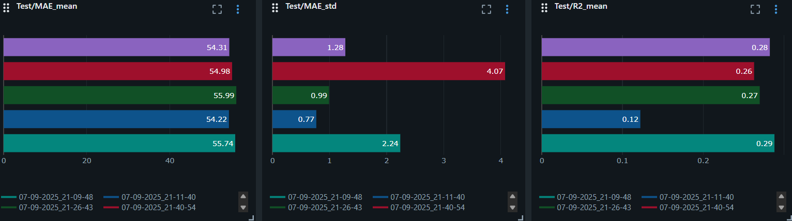
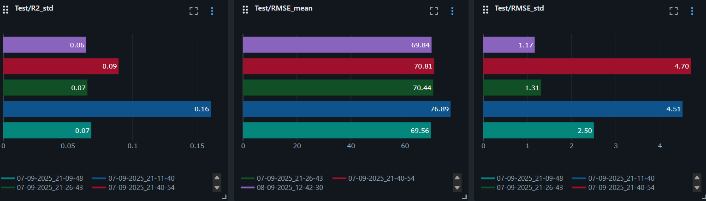

# Тестовое задание по созданию ML-моделей для предсказания температур кипения и плавления

## Общее описание проекта
В репозитории собраны эксперименты и готовые скрипты для построения моделей машинного обучения, предсказывающих **температуры кипения** и **температуры плавления** химических соединений.  
Структура проекта организована следующим образом:

- **`notebooks/`**  
  Jupyter-ноутбуки для анализа данных, подготовки признаков, подбора и оптимизации моделей.

- **`src/scripts/`**  
  Python-скрипты для обучения моделей на полном датасете.  

- **`models/`**  
  Сохранённые модели в формате pickle, организованные по задаче и версии:
  - `models/boiling_points_models/v1`, `models/boiling_points_models/v2`  
  - `models/melting_points_models/v1`

---

## Итоговые результаты моделей

### Температура кипения
| Версия | R² (mean ± std)       | RMSE (mean ± std)          |
|--------|-----------------------|----------------------------|
| v1     | 0.7470 ± 0.0289       | 43.6810 ± 2.5702           |
| v2     | 0.7441 ± 0.0263       | 43.9730 ± 2.7548           |

### Температура плавления
| Версия | R² (mean ± std)       | RMSE (mean ± std)          |
|--------|-----------------------|----------------------------|
| v1     | 0.4148 ± 0.0645       | 62.9990 ± 0.5968           |

---

## Эксперименты с GNN-моделями

Для задачи предсказания **температуры плавления** были протестированы несколько простых архитектур графовых нейронных сетей:  
- **GCN** (Graph Convolutional Network)  
- **GAT** (Graph Attention Network)  
- **GCN + RDKit дескрипторы** (гибридный подход, объединяющий графовые признаки и молекулярные дескрипторы)

### Метрики на тестовой выборке
Ниже представлены результаты (R², RMSE, MAE) для различных экспериментов.  

### Краткие выводы
- На тестовой выборке **качество GNN-моделей для температуры плавления остаётся ограниченным** (R² в диапазоне 0.12–0.29).  
- Наилучшие результаты достигаются при использовании чистой (без аугментации вектора с помощью RDKit) GCN архитектуры.
- RMSE варьируется в пределах ~69–77, что хуже, чем у бейзлайн модели.  
